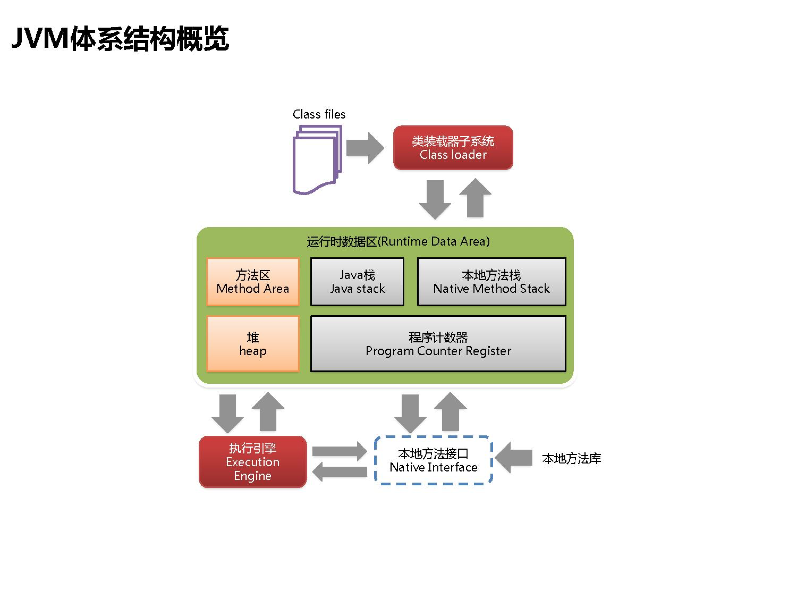
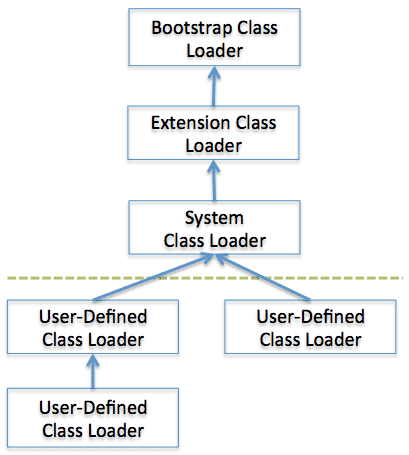

JVM_01:JVM体系结构

[TOC]

## Classloader 和 Execution Engine

classloader负责加载class文件，class文件在文件开头有特定的文件标示，并且ClassLoader只负责class文件的加载，至于它是否可以运行，则由Execution Engine决定 

加载方式: 双亲委派模型

虚拟机自带的加载器

- 启动类加载器（Bootstrap）C++
- 扩展类加载器（Extension）Java
- 应用程序类加载器（AppClassLoader）Java

  也叫系统类加载器，加载当前应用的classpath的所有类

用户自定义加载器  

- Java.lang.ClassLoader的子类，用户可以定制类的加载方式

意义: 防止内存中出现多份同样的字节码,不同的classloader 加载用一个类实际上是不相同的。

tk.mybatis 某个版本在Spring Boot2.0 中使用就遇到过, Spring Boot2.0 使用 devtools时启用了另外的一个classloader，导致scan的通用mapper类不一样，报`Cannot cast x.y.Z to x.y.Z`

https://github.com/abel533/mapper-cast-exception  也是和大牛的一次接触，远程给解决的

**Execution Engine**执行引擎负责解释命令，提交操作系统执行

## 运行时数据区域

### 本地方法栈

它的具体做法是Native Method Stack中登记native方法，在Execution Engine 执行时加载本地方法库

### 程序计数器

每个线程都有一个程序计数器，是线程私有的,就是一个指针，指向方法区中的方法字节码（用来存储指向下一条指令的地址,也即将要执行的指令代码），由执行引擎读取下一条指令，是一个非常小的内存空间，几乎可以忽略不记。

### 方法区(Method Area)

方法区是被所有线程共享，所有字段和方法字节码，以及一些特殊方法如构造函数，接口代码也在此定义。简单说，所有定义的方法的信息都保存在该区域，此区属于共享区间。 

**静态变量+常量+类信息(构造方法/接口定义)+运行时常量池存在方法区中**

Java 栈(Java stack)

### 堆(heap)

## 